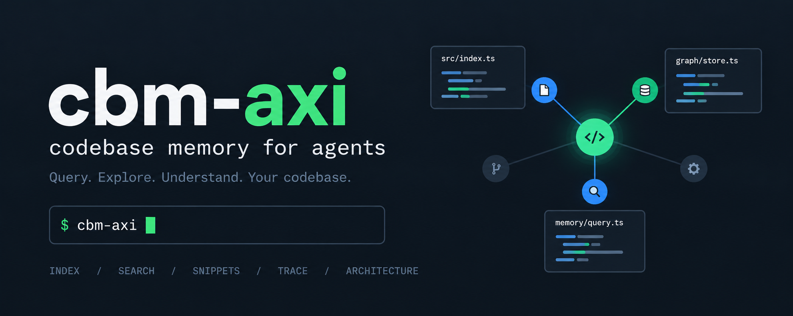

<h1 align="center">cbm-axi</h1>

`cbm-axi` is an [Agent eXperience Interface (AXI)](https://github.com/kunchenguid/axi) for codebase-memory-mcp. It gives AI agents compact, structured commands for indexing and exploring source-code graphs.

## Install

cbm-axi requires Node.js 24 or newer and codebase-memory-mcp 0.11.0 or newer. Install both commands globally with npm:

```sh
npm install --global codebase-memory-mcp
npm install --global @nikolauska/cbm-axi
cbm-axi --help
```

For sustained exploration sessions, start the upstream daemon separately:

```sh
codebase-memory-mcp daemon start
```

cbm-axi invokes the installed backend. It does not install, update, start, stop, or otherwise manage codebase-memory-mcp.

## Install agent guidance

Install optional user-level session hooks for Claude Code, Codex, and OpenCode:

```sh
cbm-axi setup hooks
```

Alternatively, install the portable Agent Skill with the [Skills CLI](https://github.com/vercel-labs/skills):

```sh
skills add nikolauska/codebase-memory-mcp-axi --skill cbm-axi
```

These options install agent guidance. The `cbm-axi` and `codebase-memory-mcp` commands must still be installed separately.

Read [how cbm-axi works](docs/domain/how-cbm-axi-works.md) for the product workflow and [CONTRIBUTING.md](CONTRIBUTING.md) to work on the project. For agent usage, see the [cbm-axi skill](skills/cbm-axi/SKILL.md).
